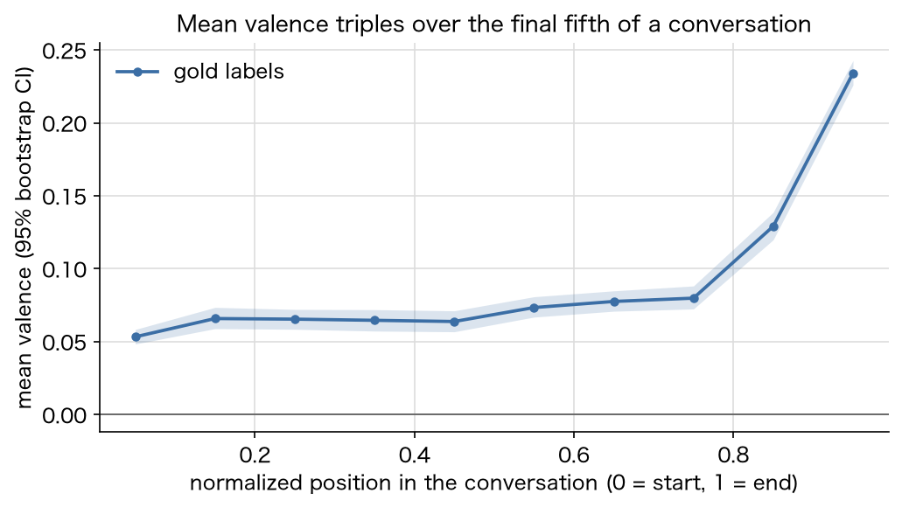
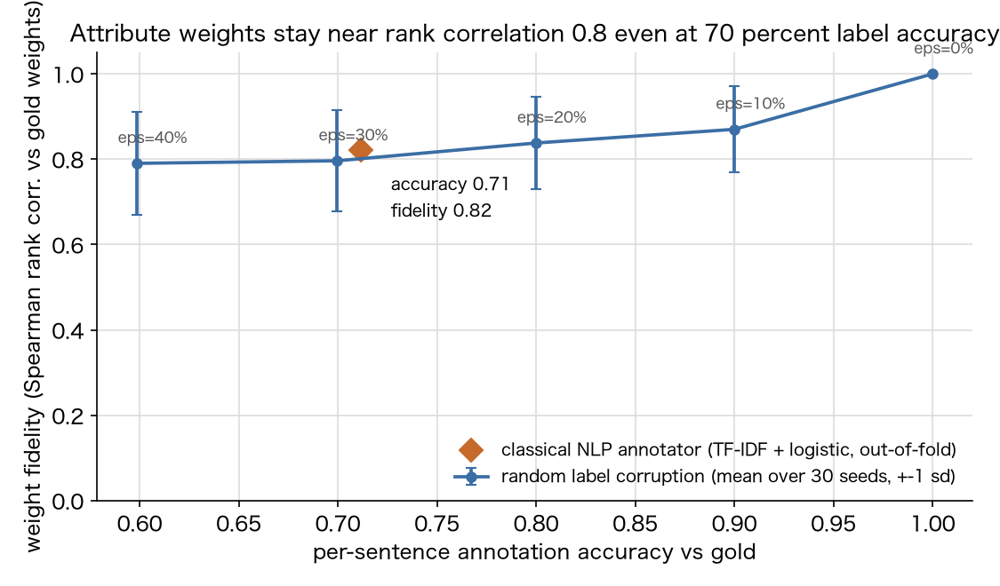

# voc-emotion-trajectories

English version: [README.md](./README.md)

VoC（顧客の声）分析のための感情軌跡モデリング。DailyDialog を題材に、発話単位の感情分類にとどまらず、会話を時系列として扱う軌跡レイヤーを実装し、分類器の誤差が軌跡にどこまで波及するかを正直に測定する。



公開されている感情分析プロジェクトの多くは発話 1 件のラベリングで止まる。しかし VoC 実務で知りたいのは「会話がどう動いたか」——クレームの後に持ち直したか、始まりより良い状態で終わったか——である。本リポジトリはその軌跡レイヤーを作る。感情→バレンス写像（モデリング上の選択として明記）、EWMA 平滑化した会話ごとのタイムライン、正規化位置軸での平均アーク（発話でなく会話単位のブートストラップ信頼帯）、感情間のマルコフ遷移行列、埋め込みシフトで検証済みの変化点検出器。土台の分類器を TF-IDF + ロジスティック回帰にしたのは意図的で、数秒で学習でき、誤りが検査可能で、ノートブック 03 でその誤りが軌跡に与える影響を仮定でなく数値で示せる。

## ノートブック一覧

| # | ノートブック | 内容 |
|---|---|---|
| 01 | [発話感情分類器](notebooks/01_utterance_emotion_classifier.ipynb) | 83% が no_emotion という不均衡の可視化、リーク防止の会話単位分割、多数派・キーワード辞書ベースラインと TF-IDF + ロジスティック回帰の比較（マクロ F1 0.390 / 0.286 / 0.129、assert で検証）。fear と disgust はこの規模では実質学習不能であることをクラス別に明示 |
| 02 | [感情軌跡](notebooks/02_emotion_trajectories.ipynb) | 正解ラベルのみでの軌跡分析。バレンス写像、会話ごとのタイムライン、平均アーク（会話終盤 2 割でバレンスが約 3 倍に上昇）、行和 1 を assert した遷移行列（粘るのは no_emotion と happiness だけ）、合成データの埋め込みシフトを正確な位置で検出することを assert した変化点検出器 |
| 03 | [予測 vs 正解パイプライン](notebooks/03_pipeline_predicted_vs_gold.ipynb) | 正直なエンドツーエンド検証。ホールドアウト会話上で予測ラベル由来の軌跡と正解由来の軌跡を突合。平均アークは形状がほぼ保存される（相関 0.98、0.8 超を assert）が水準は上振れ。会話単体では中央値相関 0.73、約 1 割の会話で負の相関 |
| 04 | [アノテーション品質と成果への重み](notebooks/04_annotation_to_outcome_weights.ipynb) | 第 2 のコーパス Persuasion for Good（寄付説得対話 1,017 件、うち 300 件に発話単位の戦略アノテーションと実際の寄付額）。会話属性 7 種、ブートストラップ CI 付きの標準化ロジスティック重み、そして「アノテーション精度 → 重みの忠実度」曲線。古典 NLP アノテーター（精度 0.71、κ 0.58）を同じ曲線上に配置 |

コミット済み実行の主結果: マクロ F1 0.39 の発話分類器でも、コーパス全体のバレンスアークはほぼ正確に再現される（アーク相関 0.98、ただし水準は過大）。一方、会話単体の軌跡は中央値では妥当でも約 10% の会話で大きく外れる。この方式の集計ダッシュボードは擁護可能だが、個別会話の自動診断には使えない。

ノートブック 04 はその続きの「システム化」の問いに答える。発話アノテーションを自動化しても、会話属性と成果（実際の寄付）への重みは推定できるか。正解ラベルを理想的な AI アノテーターの上限とみなし、シード付きランダム破損で精度→歪みの曲線全体を測る（正解重みとの順位相関: 完全精度で 1.00、精度 90% で 0.87、60% で 0.79）。実在の古典 NLP アノテーターはラベル精度 71% で忠実度 0.82 に位置する。会話単位の重みは個々のラベルよりアノテーション誤差にかなり頑健で、LLM はどこでも呼ばない。



## セットアップ

Python 3.11。

```
python -m venv .venv
source .venv/bin/activate
pip install -r requirements.txt
python scripts/download_data.py
jupyter lab
```

4 冊とも、ダウンロードなしで `data/sample/` のコミット済みサンプルにフォールバックして動く（CI もこの経路）。ダウンロードスクリプトは 2 データセット（計約 8.4 MB。`python scripts/download_data.py dailydialog` / `p4g` で個別取得可）を取得し、コミット済み出力はその全量での実行結果。01〜03 は各 1 分未満、04 は約 40 秒で実行できる。

## データとライセンス

| データセット | 取得元 | ライセンス | リポジトリ内 |
|---|---|---|---|
| DailyDialog（13,118 会話、発話ごとに 7 種の感情ラベル） | `yanran.li/files/ijcnlp_dailydialog.zip` の Internet Archive キャプチャ（2022-05-16）を `scripts/download_data.py` で取得 | CC BY-NC-SA 4.0 | 1,000 会話のサンプル（`data/sample/`、約 0.6 MB）を同一ライセンス・出典明記で再配布 |
| Persuasion for Good（説得対話 1,017 件と実際の寄付額。うち 300 件に文単位の戦略アノテーション） | `gitlab.com/ucdavisnlp/persuasionforgood`（data/FullData と data/AnnotatedData）を `scripts/download_data.py p4g` で取得 | Apache-2.0 | アノテーション済み 300 会話の全量（`data/sample/`、約 1.2 MB）を出典明記で再配布 |

補足:

- 2026-07 時点で元ホスト `yanran.li` はドメイン売り出し状態（ダウンロード URL は HTML プレースホルダを返す）。Hugging Face の `li2017dailydialog/daily_dialog` も同じ死んだ URL を参照するローディングスクリプトのため、Internet Archive のキャプチャを第一取得先とし、元 URL をフォールバックとして残している。
- データ利用時の引用: Li, Su, Shen, Li, Cao, Niu, "DailyDialog: A Manually Labelled Multi-turn Dialogue Dataset" (IJCNLP 2017) および Wang, Shi, Kim, Oh, Yang, Zhang, Yu, "Persuasion for Good: Towards a Personalized Persuasive Dialogue System for Social Good" (ACL 2019)。
- CC BY-NC-SA 4.0 は非商用ライセンス。コードは MIT だが、DailyDialog データを使った成果物にはデータ側のライセンスが及ぶ。Persuasion for Good データは Apache-2.0。
- Persuasion for Good の寄付額はタスク上限 $2 でウィンザライズしている。上限超えの 35 件（最大 $700）はデータセット側のドキュメントどおり入力ノイズとして扱う。

## リポジトリ構成

```
notebooks/            実行済みノートブック（出力込みでコミット）
notebooks_src/        同内容の jupytext py:percent ソース
src/voc_arc/          データ読み込み・分類器・軌跡レイヤー・作図に加え、
                      ノートブック 04 用の p4g / attributes / weights
tests/                pytest（遷移行列の手計算突合、埋め込みシフト検出、
                      重みモデルの既知係数回復を含む）
scripts/download_data.py
scripts/make_sample.py
data/sample/          出典明記付きサンプル（DailyDialog 1,000 会話、
                      Persuasion for Good アノテーション済み 300 会話）
assets/               上掲の代表図
```

## 制約と限界

- DailyDialog は語学学習向けに書かれた英語の脚本的日常会話で、実際の顧客対応ではない。会話終盤のポジティブ化の儀礼性や anger の非持続性を含め、絶対値はドメイン内データで再推定が必要。転用できるのは手法と評価設計。
- バレンス写像（happiness +1 / anger・disgust・fear・sadness -1 / surprise・no_emotion 0）はモデリング上の選択で、特に surprise の行は議論の余地がある。`src/voc_arc/trajectory.py` の小さな表 1 つで変更できる。
- ラベルは単一アノテータで約 83% が no_emotion。3 クラスは発話単位の学習にも評価にも支持数が足りない。
- コーパスごとに単一分割・単一分類器構成。Transformer との比較は意図的に含めない（本リポジトリはその比較の基準点となる軽量リファレンス）。
- 英語のみ。文字 n-gram 特徴はそのままでは他言語に転用できない。
- ノートブック 04 のノイズモデルは一様ランダムなラベル破損で、実在のアノテーター（人間・LLM とも）の誤りは系統的。古典 NLP の 1 点はこのコーパスでは近い挙動を示すが、一般法則ではなく、実際の LLM アノテーターは測定していない。
- ノートブック 04 の重みは相関であって因果効果ではない。説得者は相手に応じて戦略を変え、寄付の成立自体が会話終盤の特徴（終端バレンス等）を形づくる。

## ライセンス

コードは MIT（[LICENSE](./LICENSE)）。DailyDialog データ（コミット済みサンプルを含む）は CC BY-NC-SA 4.0、Persuasion for Good データ（コミット済みサンプルを含む）は Apache-2.0（上表参照）。
